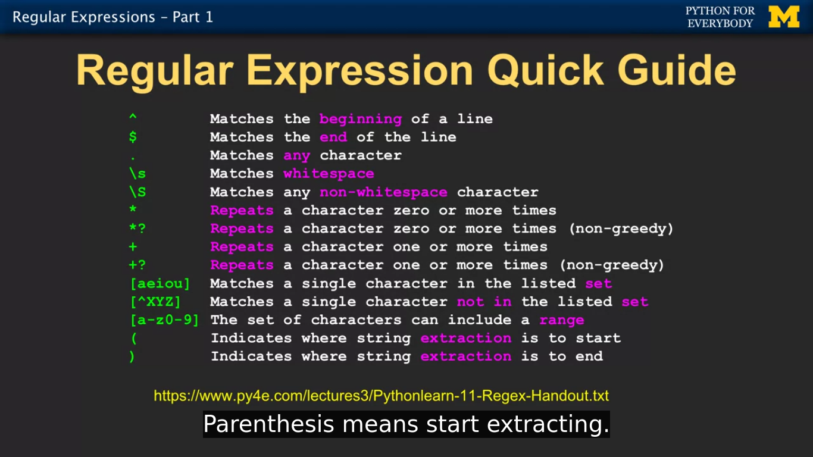

## Regex

> Always returns the largest string that matches the regex expression

> Using '?' at the end of the expression make it non-greedy in which case the expression will return the shortest matched string

```
'+' -> 1 or more characters in a string
'*' -> 0 0r more characters in a string
```

### Regex Syntax



### Regex Declaration
```python
import re
re.search('^Start', string)
```

### re.search()
> same as string.find()
```python
# print line which contains 'From'
file_handler = handle("something.txt")
for line in file_handler:
  if line.find('From'):
    print(line)

  ## using regex
  if re.search('From', line):
    print(line)

# print line start with 'From'
file_handler = handle("something.txt")
for line in file_handler:
  if line.startswith('From'):
    print(line)

  ## using regex
  if re.search('^From', line):
    print(line)
```

### re.findall()
> extract portion of the string which matches with regex. similar to string.find() and slicing (list[4:9])
```python
search_list = re.findall('[0-9]+', line)
```