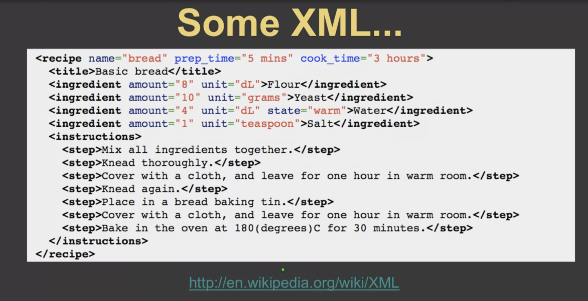
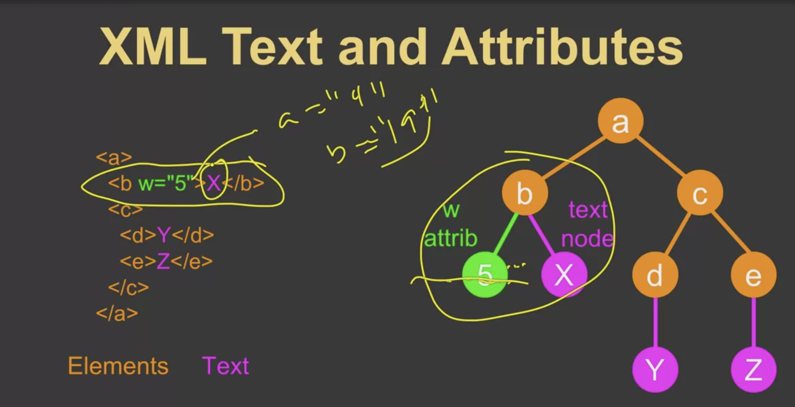

# XML
> eXtensible Markup Language

## XML Basics

### Syntax
> XML consists of nodes or elements
```html
<person>
  <name type='intl'>
    <firstname>Reyan</firstname>
    <lastname>Salehin</lastname>
  </name>
</person>

Simple element: Only have data inside it like 'firstname' element

Complex element: Have child nodes inside it

<!-- Start tag can have attributes -->
```

### XML Basics
> HTML has predefined tags, where in XML tages can be made based on data


> in the pic, the "email" tag doesn't contain data; if we want the tag not to contain data, we can define them like this

### Whitespace
> Whitespaces between the tags don't matter but whitespaces inside the tags matters or included in data
```html
<person>
  <name>Reyan  </name>
</person>

> the whitespaces between the 'person' tag and 'name' tag don't matter

> the whitespaces inside the 'name' tag will be considered as data; like 'Reyan  '
```

### XML Example


### XML Terminology


### XML as a tree
> An element can contain child node/s or data, both are represented as child node/s in tree; a node can contain attribute and data, in this case all the attributes will be 'attribute nodes' and data will be 'text node'. They will both be added as child node/s.



### XML as path
> created like file structure


## XML Schema
> XML schema is a contract as to what is acceptable as XML between applications


### Syntax (schema contract)


### XSD XML Schema


### XSD XML schema contract structure


### XSD constraints


### XSD Data Types


### ISO Time format


### XSD examples


