# Class and Object

## Object
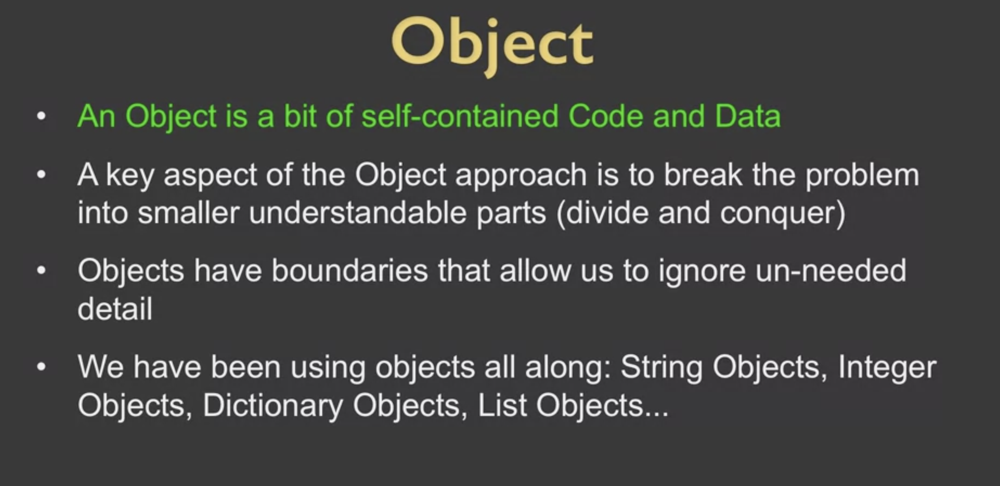

> Object visualization in python
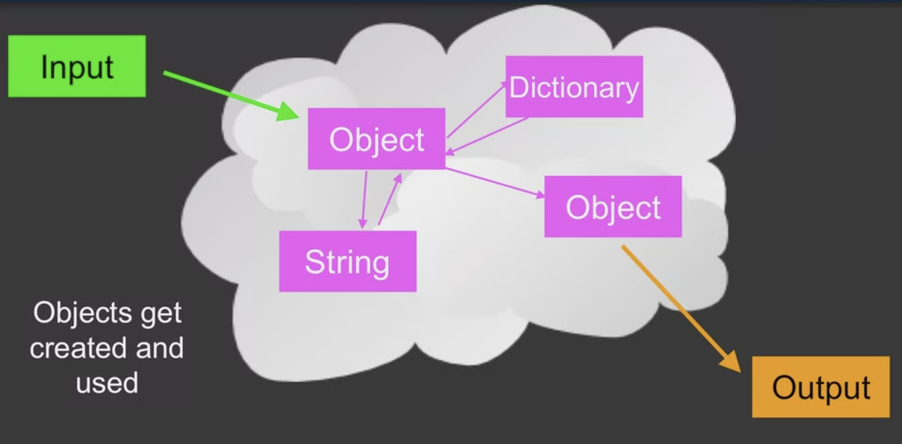

> Object element division
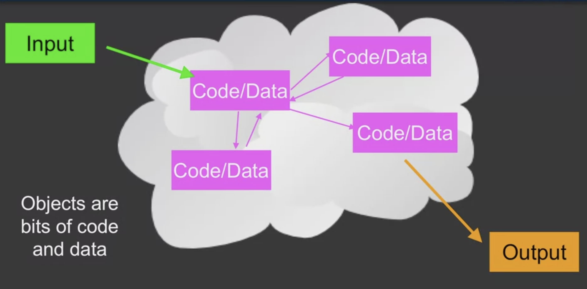

> Object from inside
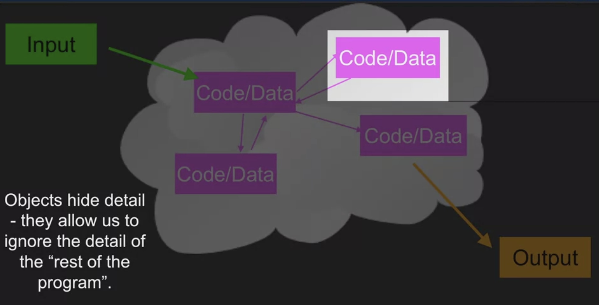

> Object from outside
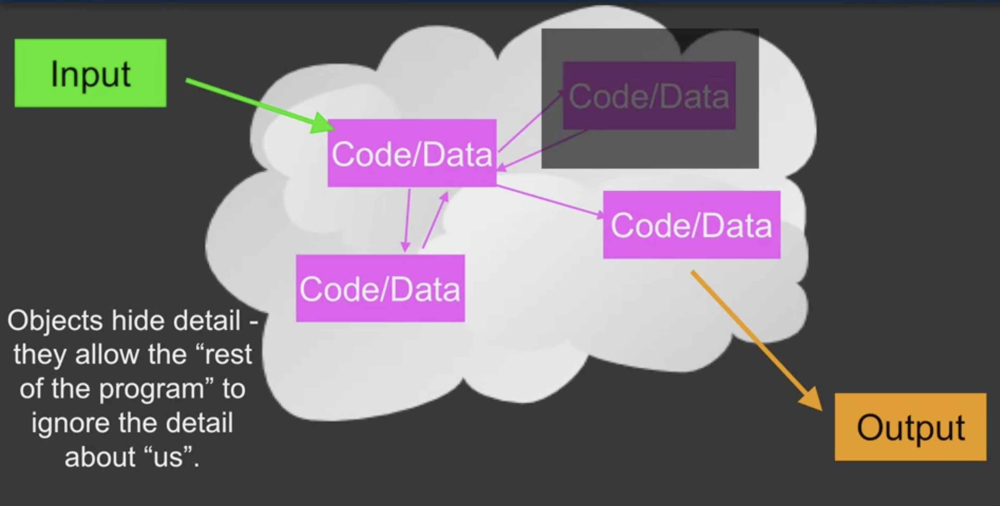

## Definitions
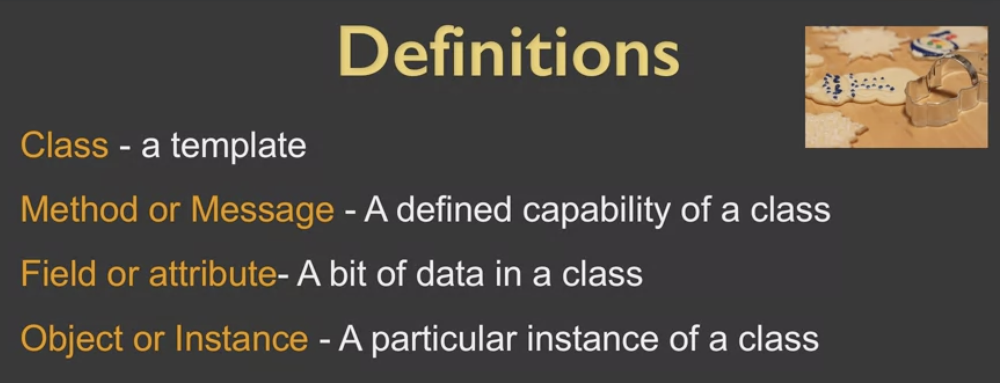

## Life Cycle
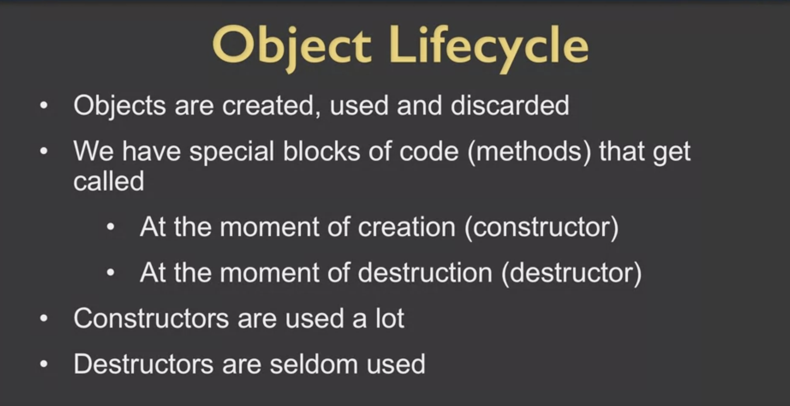

## Many Instances
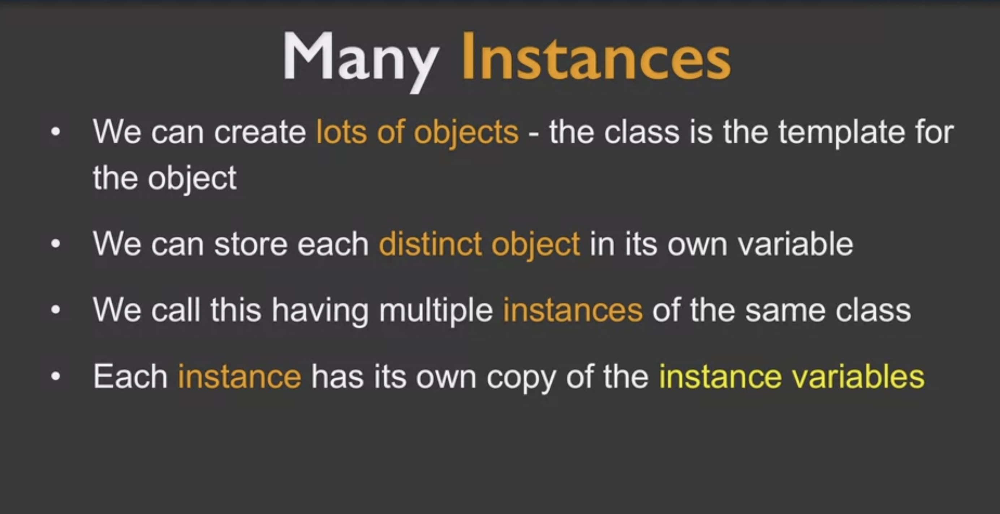

## Constructor
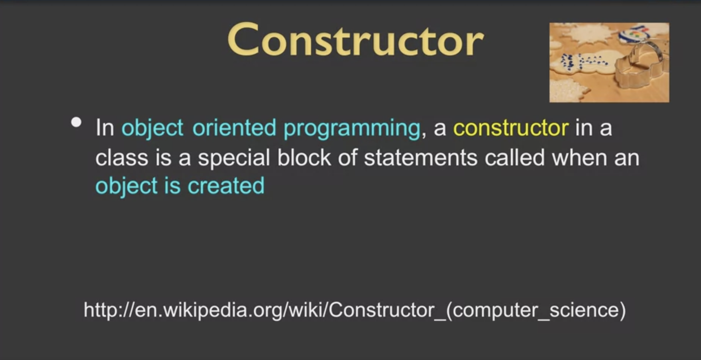

## Class Structure
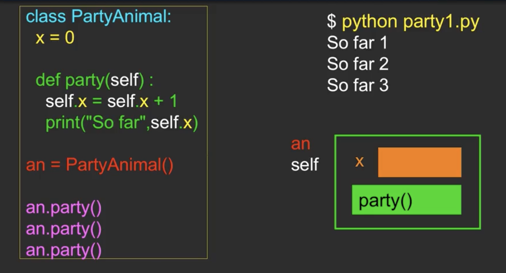
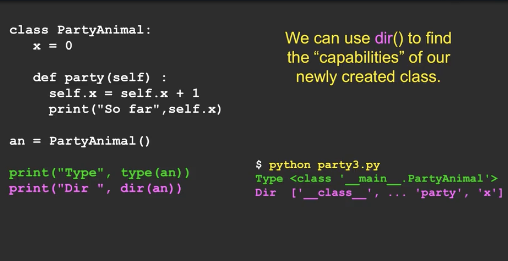
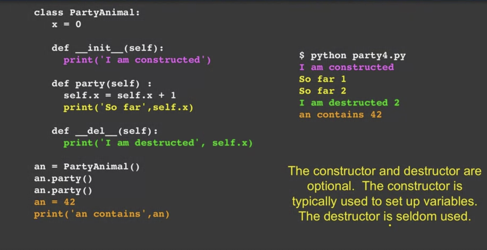

## type() and dir()
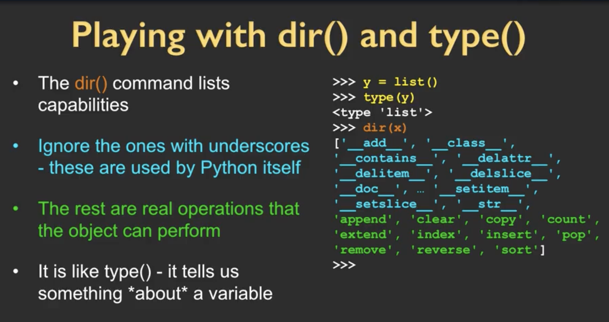

> Default objects examples in python
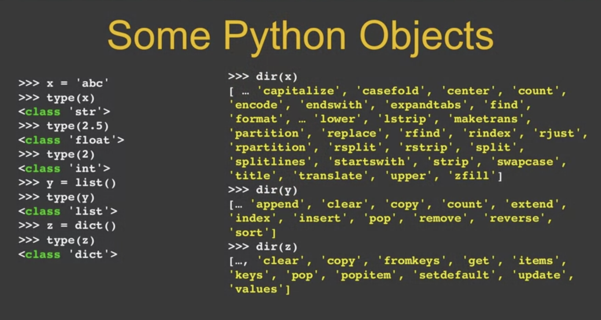

> dir() in string
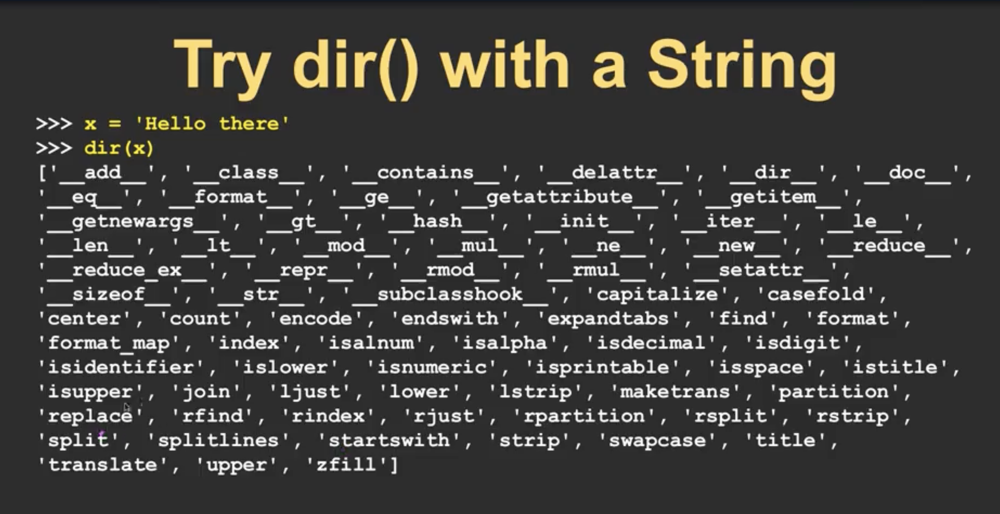
